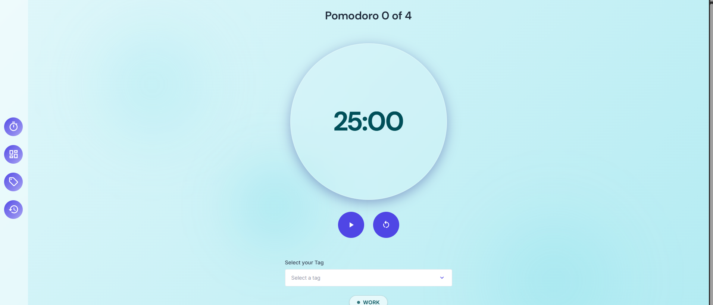
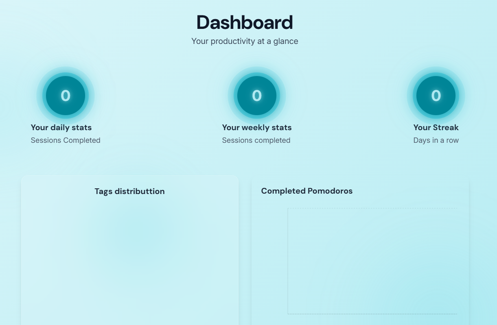
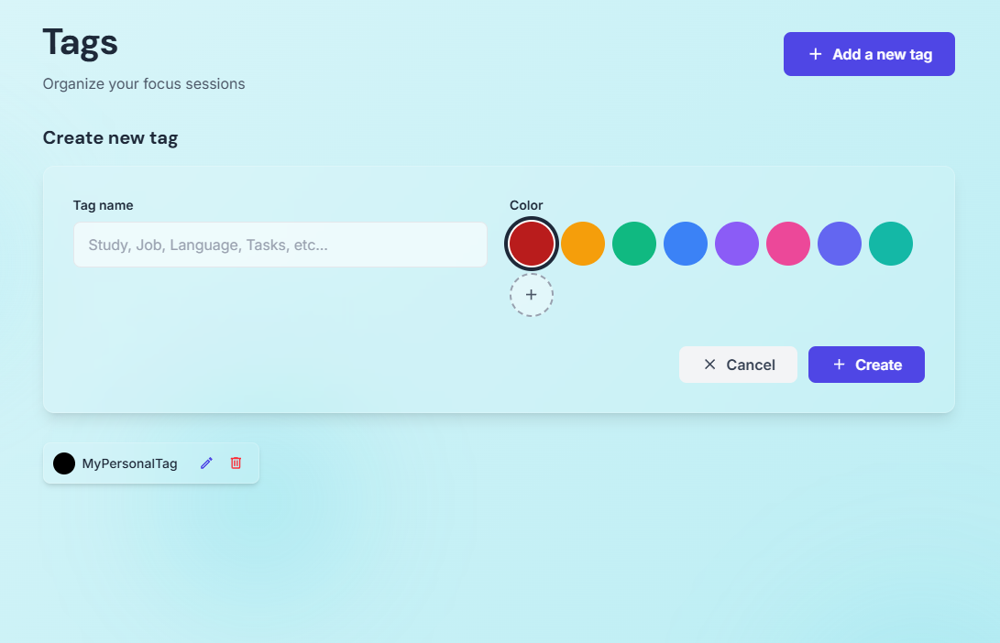
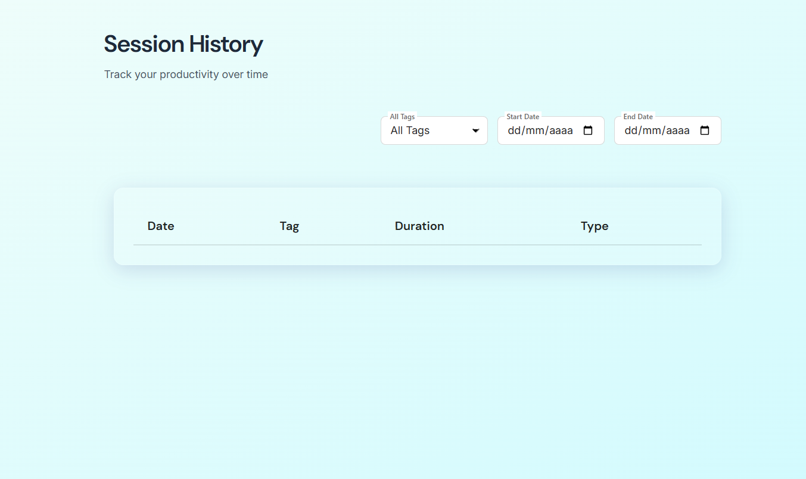

# 🍅 Pomodoro App

A full-stack productivity application built with React, TypeScript, and Express to help you master the Pomodoro Technique with smart session tracking and insightful analytics.

[](https://github.com/YOUR_USERNAME/YOUR_REPO/actions)

**🌐 Live Demo:** [https://pomodoro-web-app-umber.vercel.app/](https://pomodoro-web-app-umber.vercel.app/)

---

## 📸 Screenshots







---

## ✨ Features

- ⏱️ **Full Pomodoro Cycle** - Complete 4-pomodoro workflow (25min work → 5min break → repeat → 15min long break)
- 🏷️ **Custom Tags** - Organize and categorize your focus sessions with customizable tags
- 📊 **Smart Statistics** - Track your productivity with daily, weekly, and streak metrics
- 📈 **Visual Analytics** - Interactive charts for session distribution and tag usage
- 📅 **Session History** - Complete log of all your completed pomodoros
- 🎨 **Modern UI** - Clean, responsive interface built with Tailwind CSS
- 🔄 **Real-time Sync** - Automatic session saving and data synchronization
- 🧪 **Fully Tested** - Comprehensive test coverage with Vitest

---

## 🛠️ Tech Stack

### Frontend
- **React 19** - UI library with latest features
- **TypeScript 5.8** - Type-safe development
- **Vite 6** - Lightning-fast build tool
- **Tailwind CSS 4** - Utility-first styling
- **React Router 7** - Client-side routing
- **Recharts** - Data visualization
- **Vitest** - Unit and integration testing

### Backend
- **Node.js** - Runtime environment
- **Express 5** - Web framework
- **TypeScript 5.9** - Type-safe server code
- **UUID** - Unique identifier generation
- **CORS** - Cross-origin resource sharing
- **Vitest + Supertest** - API testing

### DevOps
- **GitHub Actions** - Automated CI/CD pipeline
- **Vercel** - Frontend hosting
- **Render** - Backend hosting

---

## 📁 Project Structure

```
Pomodoro/
├── .github/
│   └── workflows/
│       └── ci.yml                    # CI/CD pipeline configuration
│
├── pomodoro_backend/
│   ├── src/
│   │   ├── __tests__/               # API tests
│   │   ├── controllers/             # Request handlers
│   │   ├── data/                    # JSON data storage
│   │   │   ├── sessions.json
│   │   │   └── tags.json
│   │   ├── routes/                  # API endpoints
│   │   │   ├── sessionsRoutes.ts
│   │   │   ├── statsRoutes.ts
│   │   │   └── tagsRoutes.ts
│   │   ├── types/                   # TypeScript interfaces
│   │   ├── utils/                   # Helper functions
│   │   ├── app.ts                   # Express app setup
│   │   └── index.ts                 # Server entry point
│   ├── package.json
│   └── tsconfig.json
│
└── pomodoro_frontend/
    ├── src/
    │   ├── assets/                  # Static files
    │   ├── components/              # React components
    │   │   ├── AnimatedBackground.tsx
    │   │   ├── FilterBar.tsx
    │   │   ├── Footer.tsx
    │   │   ├── SessionsList.tsx
    │   │   ├── Sidebar.tsx
    │   │   ├── StatsBar.tsx
    │   │   ├── StatsCard.tsx
    │   │   ├── StatsPie.tsx
    │   │   ├── TagForm.tsx
    │   │   ├── TagSelector.tsx
    │   │   ├── TagsList.tsx
    │   │   └── TimerDisplay.tsx
    │   ├── hooks/
    │   │   ├── __tests__/           # Hook tests
    │   │   └── useTimer.ts          # Custom timer logic
    │   ├── pages/                   # Route pages
    │   │   ├── Dashboard.tsx
    │   │   ├── History.tsx
    │   │   ├── Tags.tsx
    │   │   └── Timer.tsx
    │   ├── services/                # API calls
    │   │   ├── sessionService.ts
    │   │   ├── statsService.ts
    │   │   └── tagService.ts
    │   ├── types/                   # TypeScript interfaces
    │   ├── App.tsx
    │   └── main.tsx
    ├── package.json
    ├── vite.config.ts
    ├── vitest.config.ts
    └── vercel.json
```

---

## 🚀 Getting Started

### Prerequisites

- **Node.js** >= 18.x
- **npm** >= 9.x

### Installation

1. **Clone the repository**
   ```bash
   git clone https://github.com/YOUR_USERNAME/YOUR_REPO.git
   cd Pomodoro
   ```

2. **Install backend dependencies**
   ```bash
   cd pomodoro_backend
   npm install
   ```

3. **Install frontend dependencies**
   ```bash
   cd ../pomodoro_frontend
   npm install
   ```

### Configuration

#### Backend (.env)
Create a `.env` file in `pomodoro_backend/`:
```env
PORT=3000
FRONTEND_URL=http://localhost:5173
```

#### Frontend (.env)
Create a `.env` file in `pomodoro_frontend/`:
```env
VITE_API_URL=http://localhost:3000
```

### Running Locally

#### Start Backend Server
```bash
cd pomodoro_backend
npm run dev
```
Server will run on `http://localhost:3000`

#### Start Frontend Development Server
```bash
cd pomodoro_frontend
npm run dev
```
App will be available at `http://localhost:5173`

### Running Tests

#### Backend Tests
```bash
cd pomodoro_backend
npm test
```

#### Frontend Tests
```bash
cd pomodoro_frontend
npm test
```

---

## 🌐 Deployment

### Frontend (Vercel)

The frontend is automatically deployed to Vercel on every push to the `main` branch.

**Manual deployment:**
```bash
cd pomodoro_frontend
npm run build
# Deploy the dist/ folder to Vercel
```

### Backend (Render)

The backend is deployed on Render's free tier.

**Important:** The free tier uses ephemeral storage. See [Known Issues](#-known-issues) below.

---

## 🧪 CI/CD Pipeline

GitHub Actions automatically runs on every push and pull request to `main`:

1. ✅ Checkout code
2. ✅ Setup Node.js 18
3. ✅ Install backend dependencies
4. ✅ Run backend tests
5. ✅ Install frontend dependencies
6. ✅ Run frontend tests

View the workflow: `.github/workflows/ci.yml`

---

## 📡 API Documentation

### Base URL
```
Production: https://your-backend.onrender.com
Development: http://localhost:3000
```

### Endpoints

#### Sessions
- `GET /sessions` - Get all sessions
- `GET /sessions/:id` - Get specific session
- `POST /sessions` - Create new session
- `DELETE /sessions/:id` - Delete session

#### Tags
- `GET /tags` - Get all tags
- `POST /tags` - Create new tag
- `PUT /tags/:id` - Update tag
- `DELETE /tags/:id` - Delete tag

#### Statistics
- `GET /stats/today` - Get today's pomodoro count
- `GET /stats/week` - Get this week's pomodoro count
- `GET /stats/streak` - Get current streak

---

## ⚠️ Known Issues

### Data Persistence Problem
**Issue:** Tags and sessions disappear after backend restart on Render's free tier.

**Cause:** Render's free tier uses ephemeral storage. JSON files (`sessions.json`, `tags.json`) are reset on every restart (happens after 15 minutes of inactivity).

**Solution (In Progress):** Migrating to persistent database
- Branch: `database-migration`
- Options being evaluated: MongoDB Atlas, PostgreSQL, Supabase

---

## 🗺️ Roadmap

- [ ] **Database Integration** - Migrate from JSON to MongoDB/PostgreSQL
- [ ] **User Authentication** - Add user accounts and login
- [ ] **Data Export** - Export sessions to CSV/PDF
- [ ] **Custom Timer Settings** - Configurable work/break durations
- [ ] **Sound Notifications** - Audio alerts on timer completion
- [ ] **Dark Mode** - Theme toggle
- [ ] **Mobile App** - React Native version

---

## 🤝 Contributing

Contributions are welcome! Please follow these steps:

1. Fork the repository
2. Create a feature branch (`git checkout -b feature/AmazingFeature`)
3. Commit your changes (`git commit -m 'Add some AmazingFeature'`)
4. Push to the branch (`git push origin feature/AmazingFeature`)
5. Open a Pull Request

### Development Guidelines
- Write tests for new features
- Follow existing code style (TypeScript + ESLint)
- Update documentation as needed
- Ensure CI pipeline passes

---

## 📝 License

This project is licensed under the ISC License.

---